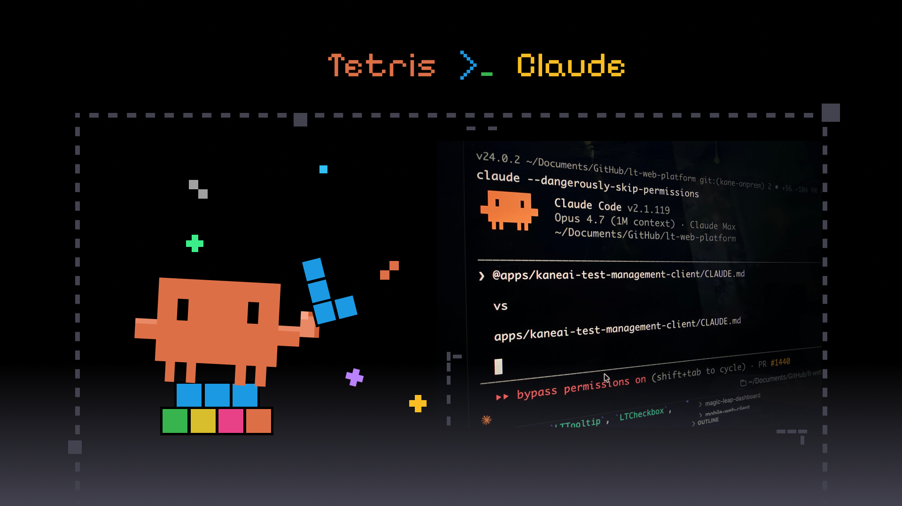

<div align="center">



# 🧱 claude-tetris

### Play Tetris in a split pane beside Claude Code.

A full Tetris game that runs **alongside** Claude Code. It **auto-pauses the moment
Claude is done** — and resumes the second you type your next prompt. A tiny reward
for long coding sessions.

[](https://www.npmjs.com/package/claude-tetris)
[](https://www.npmjs.com/package/claude-tetris)
[](./LICENSE)
[](#)
[](https://nodejs.org)
[](#contributing)

</div>

---

## ✨ Features

- 🎯 **SRS rotation** + wall kicks (exact Super Rotation System)
- 🎲 **7-bag randomizer** for fair piece distribution
- 👻 **Ghost piece**, **hold**, hard / soft drop
- ⏸ **Auto-pause coupling** via Claude Code hooks — no polling, just `fs.watch`
- 🖥 **Windows Terminal split-pane** (Claude left, Tetris right)
- 📐 **Responsive TUI** that recomputes on resize (SIGWINCH)
- 🌐 **Showcase website** in [`web/`](web/README.md) — Claude-style, interactive canvas Tetris
- ⌨️ **`/tetris` slash command** for Claude Code

---

## 📦 Install

### Option A — npm (global)

```bash
npm install -g claude-tetris
claude-tetris install   # wire up the Claude Code hooks (backs up settings.json)
claude-tetris launch    # open the split pane (Claude left, Tetris right)
```

### Option B — npx (no install)

```bash
npx claude-tetris
```

### Option C — Windows double-click (easiest)

1. Double-click **`install.bat`** — hooks install automatically (your `settings.json` is backed up).
2. When prompted, open the split pane.
3. To remove: double-click **`uninstall.bat`**.

### Claude Code slash command

Once the hooks are installed, type **`/tetris`** inside Claude Code to launch the
game in a fresh split pane.

---

## 🪄 How the pause magic works

Claude Code hooks write a single signal file; the TUI watches it — no polling, no lag.

```
Claude Code  ──hook──▶  state.json  ──fs.watch──▶  Tetris TUI
 (UserPromptSubmit)      {state:"PLAY"}              (resume)
 (Stop)                  {state:"PAUSE"}             (freeze)
```

| Hook event         | Signal                | Game       |
| ------------------ | --------------------- | ---------- |
| `UserPromptSubmit` | `claude-tetris play`  | ▶ resumes  |
| `Stop`             | `claude-tetris pause` | ⏸ freezes  |

---

## 🎮 Controls

| Key           | Action                    |
| ------------- | ------------------------- |
| `←` `→`       | move                      |
| `↑` / `X`     | rotate                    |
| `↓`           | soft drop                 |
| `Space`       | hard drop                 |
| `C`           | hold                      |
| `P`           | pause / resume            |
| `Q`           | quit                      |
| `R`           | restart (after game over)|
| `F11`         | fullscreen (recommended)  |

---

## 🛠 CLI

```bash
claude-tetris              # play now (current terminal)
claude-tetris install      # install Claude Code hooks
claude-tetris uninstall    # remove hooks
claude-tetris launch       # open Windows Terminal split pane
```

Equivalent npm scripts:

```bash
npm start                  # play now
npm run install:hooks      # install hooks
npm run uninstall:hooks    # remove hooks
npm run launch             # open split pane
npm run dev                # serve the showcase website (web/)
npm test                   # run the 44 unit tests
```

---

## 🏗 Architecture

```
claude-tetris/
├── bin/tetris.mjs        # CLI entry (npx claude-tetris)
├── game/
│   ├── core.mjs          # headless engine (testable, no I/O)
│   └── tui.mjs           # terminal UI: ANSI render, raw keys, signal watch
├── lib/signal.mjs        # atomic state-file comms (hook ↔ TUI)
├── scripts/
│   ├── install.mjs       # merge hooks into ~/.claude/settings.json
│   ├── uninstall.mjs     # remove claude-tetris hooks only
│   ├── launch.mjs        # Windows Terminal split-pane launcher
│   └── tetris-signal.mjs # hook bridge: play / pause / status
├── claude-code/          # plugin manifest + command + hooks template
├── install.bat           # double-click Windows installer
├── uninstall.bat         # double-click Windows uninstaller
├── web/                  # showcase website (static HTML/CSS/JS)
└── tests/                # 44 unit tests (node --test)
```

**Key design decisions**

- **Headless engine** (`game/core.mjs`) — no terminal I/O, fully unit-tested.
- **Signal channel** (`lib/signal.mjs`) — atomic temp+rename writes, tolerant reads.
  Avoids Windows socket/pipe pain.
- **Hook merge** — installs never overwrite existing hooks; backups auto-created.

---

## 🧪 Development

```bash
git clone https://github.com/philppplik/claude-tetris.git
cd claude-tetris
npm test            # 44 tests, ~1s
npm run dev         # open the showcase site at http://localhost:8137
```

---

## 🤝 Contributing

PRs welcome! The engine (`game/core.mjs`) is fully headless and tested — add a
feature, extend a test, open a PR.

> Built with [Hermes Agent](https://hermes-agent.nousresearch.com) 🤖 and
> [Claude](https://claude.ai) ✨ — Philipp Paulik's AI collaborators.

---

## 📜 License

MIT © Philipp Paulik
