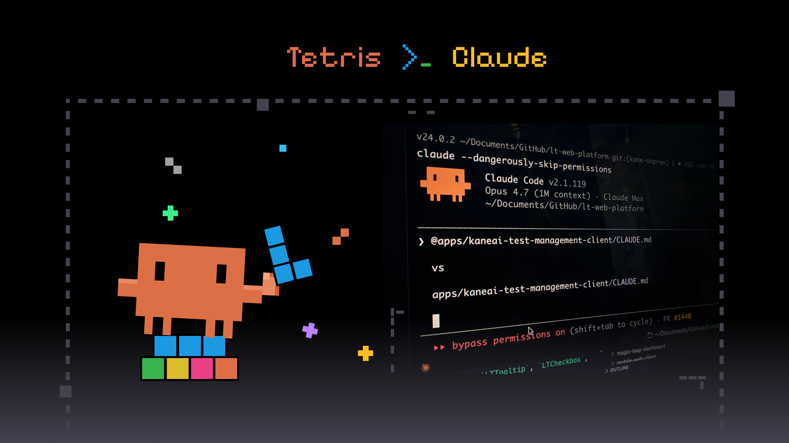
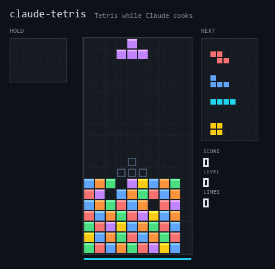

<div align="center">





# 🧱 claude-tetris

### Play Tetris in a split pane beside Claude Code.

A full Tetris game that runs **alongside** Claude Code. It **auto-pauses the moment
Claude is done** — and resumes the second you type your next prompt. A tiny reward
for long coding sessions.

[](https://github.com/philppplik/claude-tetris/actions/workflows/ci.yml)
[](https://www.npmjs.com/package/claude-tetris)
[](https://www.npmjs.com/package/claude-tetris)
[](./LICENSE)
[](https://nodejs.org)
[](#contributing)

</div>

---

## ✨ Features

- 🎯 **SRS rotation** + wall kicks (exact Super Rotation System)
- 🎲 **7-bag randomizer** for fair piece distribution
- 👻 **Ghost piece**, **hold**, hard / soft drop
- ⏱ **Lock delay** (500 ms, 15 resets) — slide and spin a piece after it lands
- ⚡ **DAS / ARR** with modern competitive defaults — tap to nudge, hold to slam
- 🏆 **Persistent highscore**, survives closing the pane
- ⏸ **Auto-pause coupling** via Claude Code hooks — no polling, just `fs.watch`
- 🖥 **Split-pane on any terminal** — Windows Terminal, tmux, iTerm2, kitty, WezTerm
- 📐 **Responsive TUI** that recomputes on resize (SIGWINCH)
- ⌨️ **`/tetris` slash command** for Claude Code

---

## 📦 Install

### Option A — Claude Code plugin (recommended)

Inside Claude Code:

```
/plugin marketplace add philppplik/claude-tetris
/plugin install claude-tetris@philppplik-plugins
```

That wires up the hooks and the `/tetris` slash command. No files of yours are
edited — Claude Code manages the plugin.

### Option B — npm (global)

```bash
npm install -g claude-tetris
claude-tetris install   # wire up the Claude Code hooks (backs up settings.json)
claude-tetris launch    # open the split pane (Claude left, Tetris right)
```

### Option C — npx (no install, just play)

```bash
npx claude-tetris
```

### Option D — Windows double-click

1. Double-click **`install.bat`** — hooks install automatically (your `settings.json` is backed up).
2. When prompted, open the split pane.
3. To remove: double-click **`uninstall.bat`**.

### Slash command

Once installed, type **`/tetris`** inside Claude Code to launch the game in a
fresh split pane.

---

## 🪄 How the pause magic works

Claude Code hooks write a single signal file; the TUI watches it — no polling, no lag.

```
Claude Code  ──hook──▶  state.json  ──fs.watch──▶  Tetris TUI
 (UserPromptSubmit)      {state:"PLAY"}              (resume)
 (Stop)                  {state:"PAUSE"}             (freeze)
```

| Hook event         | Signal                | Game       |
| ------------------ | --------------------- | ---------- |
| `UserPromptSubmit` | `claude-tetris play`  | ▶ resumes  |
| `Stop`             | `claude-tetris pause` | ⏸ freezes  |
| `Notification`     | `claude-tetris notify`| ⏸ freezes (permission prompt) |

---

## ⚙️ Tuning

| Variable | Default | What it does |
| -------- | ------- | ------------ |
| `CLAUDE_TETRIS_DAS` | `100` | Delayed Auto Shift in ms — charge time before a held key repeats |
| `CLAUDE_TETRIS_ARR` | `0` | Auto Repeat Rate in ms — `0` slides the piece straight to the wall |
| `CLAUDE_TETRIS_PAUSE_ON_PERMISSION` | on | Set to `0` to keep playing through permission prompts |
| `CLAUDE_TETRIS_DIR` | `~/.claude-tetris` | Where the signal file and highscore live |

**A note on DAS in a terminal.** A terminal in raw mode delivers key-*down* events
only — there is no key-up. Holding a key is therefore inferred from the operating
system's own auto-repeat stream, whose initial delay (typically 250–500 ms) is a
floor we cannot go below. `CLAUDE_TETRIS_DAS` applies *after* auto-repeat is
detected. What is fully under our control is what happens next, and that is the
larger part of the feel: with `ARR=0` the piece slides to the wall in one motion.
A deliberate double-tap never triggers a slide.

---

## 🎮 Controls

| Key           | Action                    |
| ------------- | ------------------------- |
| `←` `→`       | move                      |
| `↑` / `X`     | rotate                    |
| `↓`           | soft drop                 |
| `Space`       | hard drop                 |
| `C`           | hold                      |
| `P`           | pause / resume            |
| `Q`           | quit                      |
| `R`           | restart (after game over)|
| `F11`         | fullscreen (recommended)  |

---

## 🛠 CLI

```bash
claude-tetris              # play now (current terminal)
claude-tetris install      # install Claude Code hooks
claude-tetris uninstall    # remove hooks
claude-tetris launch       # open a split pane in your terminal
claude-tetris --version    # print version
claude-tetris --help       # all commands
```

`launch` takes an optional project path and `--backend=<wt|tmux|iterm|kitty|wezterm>`
to override auto-detection. Add `--dry-run` to print the command without opening
anything; combined with `--backend=` it shows that backend's command even on a
machine where it would not run.

### Supported terminals

`launch` picks the first backend that can actually split **the window you are in**:

| Terminal             | Platform | Requirement                                  |
| -------------------- | -------- | -------------------------------------------- |
| **Windows Terminal** | Windows  | `wt.exe` on `PATH`                            |
| **tmux**             | macOS/Linux | run it from *inside* a tmux session         |
| **iTerm2**           | macOS    | iTerm2 is the active terminal                 |
| **kitty**            | macOS/Linux | `allow_remote_control` enabled             |
| **WezTerm**          | any      | run it from inside WezTerm                    |

No supported terminal? Open a second window and run `claude-tetris` there. The
pause coupling goes through the signal file, so it works across windows just as well.

Equivalent npm scripts:

```bash
npm start                  # play now
npm run install:hooks      # install hooks
npm run uninstall:hooks    # remove hooks
npm run launch             # open split pane
npm test                   # run the unit tests
```

---

## 🏗 Architecture

```
claude-tetris/
├── bin/tetris.mjs        # CLI entry (npx claude-tetris)
├── game/
│   ├── core.mjs          # headless engine (testable, no I/O)
│   └── tui.mjs           # terminal UI: ANSI render, raw keys, signal watch
├── lib/signal.mjs        # atomic state-file comms (hook ↔ TUI)
├── scripts/
│   ├── install.mjs       # merge hooks into ~/.claude/settings.json
│   ├── uninstall.mjs     # remove claude-tetris hooks only
│   ├── launch.mjs        # split-pane launcher (executes the plan)
│   ├── launch-plan.mjs   # pure backend selection: wt / tmux / iTerm2 / kitty / wezterm
│   └── tetris-signal.mjs # hook bridge: play / pause / status
├── .claude-plugin/
│   ├── plugin.json       # plugin manifest
│   └── marketplace.json  # marketplace catalogue
├── hooks/hooks.json      # UserPromptSubmit → play, Stop → pause
├── commands/tetris.md    # the /tetris slash command
├── install.bat           # double-click Windows installer
├── uninstall.bat         # double-click Windows uninstaller
└── tests/                # unit tests (node --test)
```

**Key design decisions**

- **Headless engine** (`game/core.mjs`) — no terminal I/O, fully unit-tested.
- **Signal channel** (`lib/signal.mjs`) — atomic temp+rename writes, tolerant reads.
  Avoids Windows socket/pipe pain, and couples across windows, not just panes.
- **Pure launcher planning** (`scripts/launch-plan.mjs`) — backend selection takes
  `platform`, `env` and `has()` as arguments, so every terminal backend is
  testable from any machine.
- **Repository root is the plugin root** — Claude Code copies a plugin into its
  cache, and a copied plugin cannot reach outside its own directory with `../`.
  `scripts/` therefore has to live inside it.
- **Hook merge** — installs never overwrite existing hooks; backups auto-created.

---

## 🧪 Development

```bash
git clone https://github.com/philppplik/claude-tetris.git
cd claude-tetris
npm test            # no dependencies to install
npm run demo        # regenerate assets/demo.gif (needs ffmpeg)
```

The demo GIF is generated, not hand-recorded: `tools/record-demo.mjs` drives the
real engine with a fixed seed and a fixed input script, so re-running it after a UI
change produces a diff that reflects the change rather than a different playthrough.

CI runs the suite on Linux, macOS and Windows against Node 18, 20 and 22. See
[CONTRIBUTING.md](./CONTRIBUTING.md) for conventions and the release process,
and [ROADMAP.md](./ROADMAP.md) for what is planned.

---

## 🤝 Contributing

PRs welcome! The engine (`game/core.mjs`) is fully headless and tested — add a
feature, extend a test, open a PR.

> Built with [Hermes Agent](https://hermes-agent.nousresearch.com) 🤖 and
> [Claude](https://claude.ai) ✨ — Philipp Paulik's AI collaborators.

---

## 📜 License

MIT © Philipp Paulik
